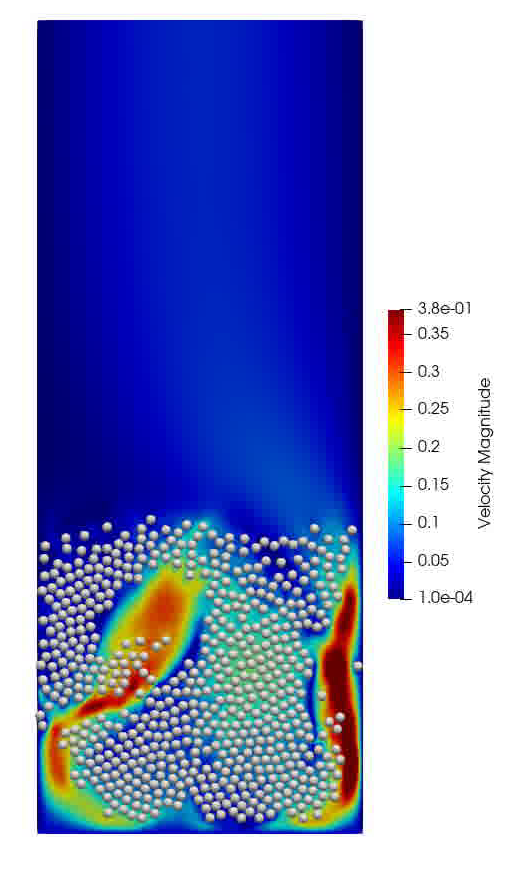

# LAMMPS-LBM-PSM

## About
This repository hosts a coupling between a Lattice Boltzmann Method (LBM) and a Discrete Element Method (DEM) to simulate fluid-particles flows.
The coupling is very suitable to simulate (dense) suspensions and to study the rheology of suspensions.
The coupled methodology is based on the Partially partially-saturated-cell scheme and more details can be found in the references listed below.

The coupling is extending the widely used open-source molecular dynamics software LAMMPS (https://www.lammps.org).
LAMMPS is used for the DEM and is extended by a LBM solver and coupling.
The advantage is that the use is straightforward by calling new LAMMPS fix styles. LAMMPS users should have no problem using the coupling. 
If unfamiliar with LAMMPS, it is recommended to have a look at the documentation (https://docs.lammps.org/Manual.html).
More details on the new fix styles can be found below.

Additional, a new LAMMPS pair style is added which allows to impose a lubrication force/torque correction for particle-particle gap distances which are unresolved due to possible limitations in the LBM lattice resolution (i.e. the lattice is at some point too fine which would result in extremely expensive simulations or simulations which are not feasible). Use of the pair style is also described below.

The code has been verified by varied cases where the numerical results are compared to analytical or empirical solutions.
The verification cases are found in a folder of the same name (verification). 
The simulations can be postprocessed with Python scripts in the corresponding folders and figures can be created with the accompanying gnuplot scripts.

The coupling can be used for different particle-laden fluid flows. For example fluidised beds in 2D:

Or 3D:

https://github.com/timnajuch/LAMMPS-LBM-PSM/assets/14159338/3f8336c5-b4cf-4411-8a9a-5de07b52ba48

## Adding this feature to LAMMPS
The current version has been tested and used with "lammps-stable_29Sep2021_update3".
Simply copy all files from the src folder into your LAMMPS src folder and compile your LAMMPS executable.

## How to use the coupled LBM-DEM feature
The LBM-DEM coupling can be used by employing some simple LAMMPS commands (fix and pair_style) in your LAMMPS input script.
The verification cases demonstrate also the usage of the new fix styles.

### fix lbm-psm
This fix employs the LBM method which updates the LBM distribution functions on each lattice node, computes the velocity field, and the hydrodynamic forces and torques acting on the particles as well as the stresslet for each particle.

fix ID group-ID lbm-psm every value Nlc value lc value rho value nu value Re value tau value Fext value_x value_y value_z

+ ID, group-ID are documented in fix command
+ lb-psm: Style name of this fix command
+ nevery value: Call the LBM methods to update the fluid fields and hydrodynamic interaction forces every this many timesteps
+ Nlc value: Number of grid nodes over the characteristic length
+ lc value: The characteristic lenght in the system (units of [length]). (E.g. the particle diameter)
+ rho value: The fluid density (units of [mass/length^3])
+ nu value: The kinematic viscosity of the fluid (units of [length^2/time]).
+ Re value: The Reynolds number defined as Uc*lc/nu. In the current implementation, the charactristic velocity Uc is computed and used to set the velocity on some boundaries (depending on the boundary conditions)
+ tau value: The LBM BGK (single) relaxation time parameter (optional, the default is tau = 0.65. Don't change it unless you know what you do)
+ Fext value_x value_y value_z: Sets a volume force, based on Guo et al. (2002), in the LBM method where each value_x/y/z defines the volume force component in x/y/z-direction, respectively. (Optional input. Units of mass/length^3*length/time^2, i.e. density*acceleration)

Example: fix lbDYN all lbm-psm every 1 Nlc 16 lc 0.0005 rho 1000.0 nu 0.0001 Re 0.1 tau 0.65 Fext -9810.0 0.0 0.0

### fix lbm-psm-vtk
Writes a vtk output file containing information on the fluid velocity field, fluid pressure field, and solid fractions of the lattice nodes.

fix ID group-ID lbm-psm-vtk every value

+ ID, group-ID are documented in fix command
+ lb-psm-vtk: Style name of this fix command
+ every value: Write the vtk output file every this many timesteps

Example: fix lbVTK all lbm-psm-vtk every 20000

### fix lbm-psm-bc
Sets a combination of boundary condition. If this fix is not used, all domain boundary conditions are periodic.\
If on one or more boundaries a velocity is set, then the magnitude is the characteristic velocity computed by the Reynolds number defined in the fix lbm-psm command (described above).\
At some point in the future, this command will be refactored so that a general user input is possible (i.e. defined pressure and/or velocity boundary conditions specifically for a domain boundary). 

fix ID group-ID lbm-psm-bc keyword

+ ID, group-ID are documented in fix command
+ lb-psm-bc: Style name of this fix command
+ keyword: Defines a combination of boundary conditions depending on the keyword which can be:
  + shear: Shear with shear gradient in y-direction. Boundaries in x-direction are periodic.
  + xFlow:  Fluid flow in positive x-direction by setting velocity on inlet boundary (boundary at smaller domain coordinate in x-direction)
      and constant density on outlet boundary (boundary at larger domain coordinate in x-direction).
      Lateral boundaries (in y-direction) have the imposed inlet velocity in x-direction.
  + channel: Two parallel plates in y-direction which are not moving. Can be used for channel flow driven by external force/pressure gradient.
  + channel-velIn-pressOut: Enclosed channel with velocity inlet, pressure outlet, and surrounding no-slip walls (can be used for fluidised bed simulation)
  + closedBox: Closed box with no-slip boundary conditions all around

Example: fix lbBC all lbm-psm-bc channel-velIn-pressOut

### fix lbRestart
Sets a combination of boundary condition. If this fix is not used, all domain boundary conditions are periodic.\
If on one or more boundaries a velocity is set, then the magnitude is the characteristic velocity computed by the Reynolds number defined in the fix lbm-psm command (described above).\
At some point in the future, this command will be refactored so that a general user input is possible (i.e. defined pressure and/or velocity boundary conditions specifically for a domain boundary). 

fix ID group-ID lbm-psm-restart every value write value read value

+ ID, group-ID are documented in fix command
+ lbm-psm-restart: Style name of this fix command
+ every value: Write the binary restart output file for the LBM distribution functions every this many timesteps
+ write value: Write the binart restart file when the value is set to 1 (does not write if set to 0)
+ read value: Read the written bindary restart file when the value is set to 1 (does not write if set to 0)

Example: fix lbRestart all lbm-psm-restart every 10000 write 1 read 0

### pair_style lubricate/GRM/LBDEM
Imposes a lubrication force and torque correction for particles in close proximity where the gap distance is below a defined threshold.

pair_style lubricate/GRM/LBDEM mu ci co componet calibrationFactor

+ style = lubricate/GRM/LBDEM
+ mu = The dynamic viscosity of the fluid (unit of [mass/(length*time)])
+ ci = Inner cut-off below which the correction force/torque correction is computed based on the inner cut-off value as gap distance
+ co = Outer cut-off below which the lubrication force/torque correction is computed (value should be set to the lattice cell width which is the theoretical resolution limit)
+ component: Integer value which defines which lubrication correction component is computed
  + 1: Squeezing terms X_A (leads to a normal force for a relative particle-particle motion along the center-to-center line)
  + 2: Shearing terms Y_A (leads to a tangential force due to a relative tangential particle-particle motion)
  + 3: Shearing terms Y_B (leads to a torque due to a relative tangential particle-particle motion)
  + 4: Terms Y_B for forces from rotations
  + 5: Rotational Y_C terms (leads to a torque due to particle rotations)
+ calibrationFactor: Modifies the outer cut-off by multiplicaiton with this factor for calibration purposes (more details listed in one of the below publications [Najuch and Sun (2023)])

Example: pair_style lubricate/GRM/LBDEM 0.1 5.0e-11 3.3333333333333335e-05 1 0.75

## Other remarks
I (Tim Najuch) used during my Ph.D. an open-source Palabos-LIGGGHTS coupling (https://github.com/ParticulateFlow/LBDEMcoupling-public) with my own modifications and developments (never pushed my modifications to GitHub, but perhaps will do).
Some code parts are based & inspired by the coupling and from my development efforts during my Ph.D.
Some of my main motivations of developing the coupling for LAMMPS were:
+ Try to reproduce my main Ph.D. findings with a somewhat different code which I wrote from scratch (I could reproduce my finding with the code hosted in this repo!) due to the complexity of the previous code, which coupled two massive software packages, and the therefore inherent confidence lack in the correctness of the coupled code
+ Use this new code in this repository to work on the underlying methodology
+ Provide an easy and straightforward use of a coupled LBM-DEM method for the wider scientific community in a framework of a popular open-source software (LAMMPS)

## References to cite when using this package
If you use this LAMMPS extension, then please cite the following paper and possibly this repository (which has a .cff file):

My paper in which the underlying methodology is analysed. It cou be cited in the methodology section of your paper:

+ Tim Najuch and Jin Sun, "Analysis of two partially-saturated-cell methods for lattice Boltzmann simulation of granular suspension rheology", Computers & Fluids, Volume 189, 15 July 2019, Pages 1-12, 
Url: https://www.sciencedirect.com/science/article/abs/pii/S0045793019301458

A written document on the lubrication force and torque correction will follow.

## License

This software is distributed under the [GNU General Public License](https://www.gnu.org/licenses/gpl-3.0.html).

Author: Tim Najuch, 2023
