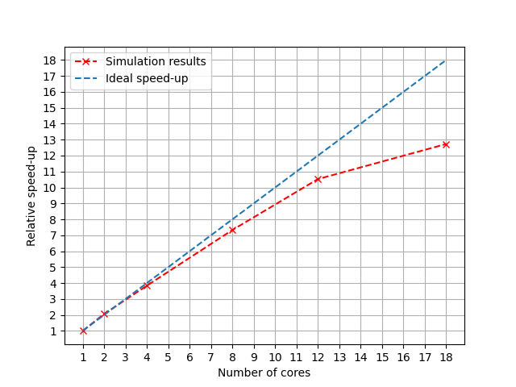

# Benchmark

## Hardware and results discussions
As a benchmark, one of the verification cases with an increased resolution was used.
A single fixed sphere in a sheared 3D cubic domain with more than than 27 million lattice nodes.
The benchmark was run on an old HP workstation (Z8-G4) as I have currently no access to a HPC system.
The workstation has two processor sockets with each having a Xeon Silver 4114 (10 physical cores). 
Using more than 10 cores will result in both sharing/competing over the memory bandwidth. This explains the "flattening" of the speed-up curve for more than 12 cores as the limiting factor is the memory bandwidth.
It would be interesting to run the benchmark on a HPC where each computational node has its own memory. 

